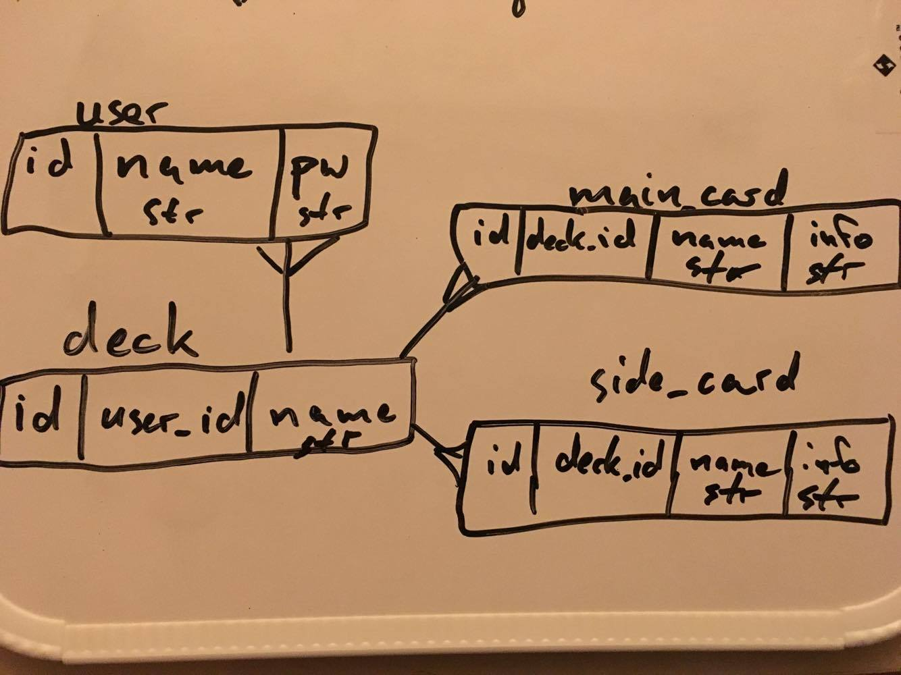
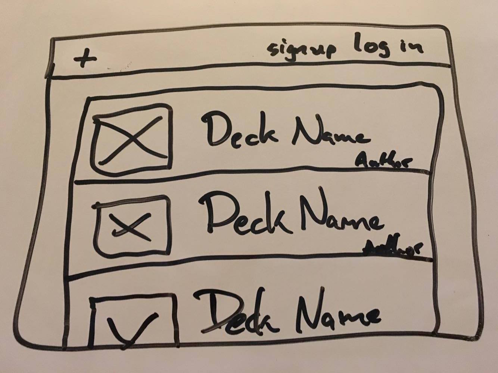
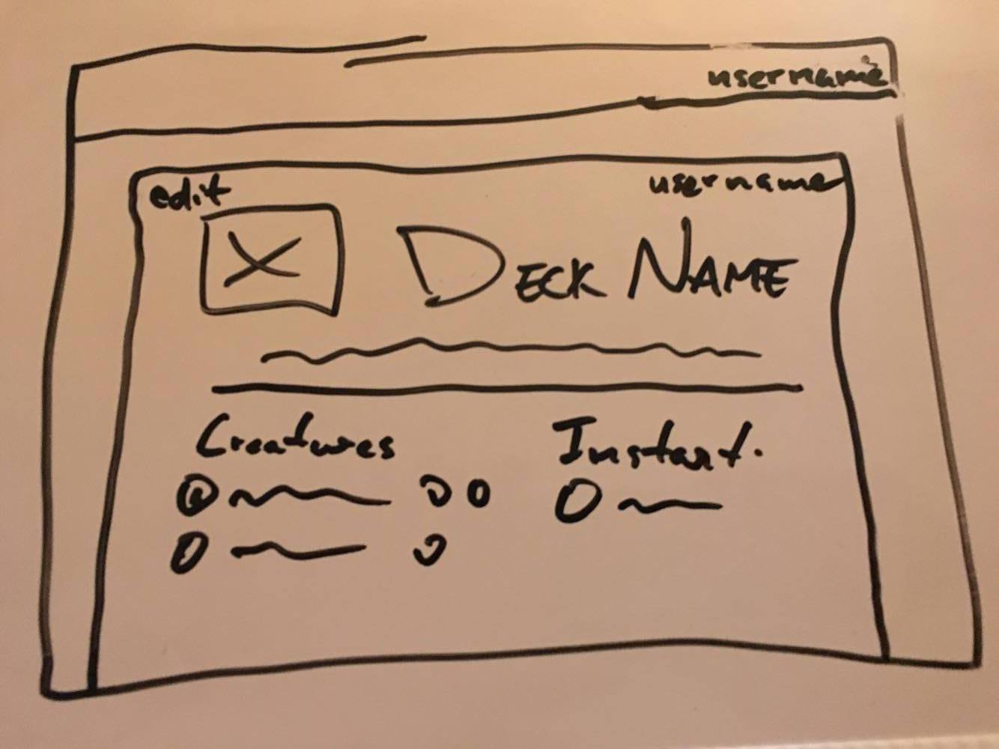
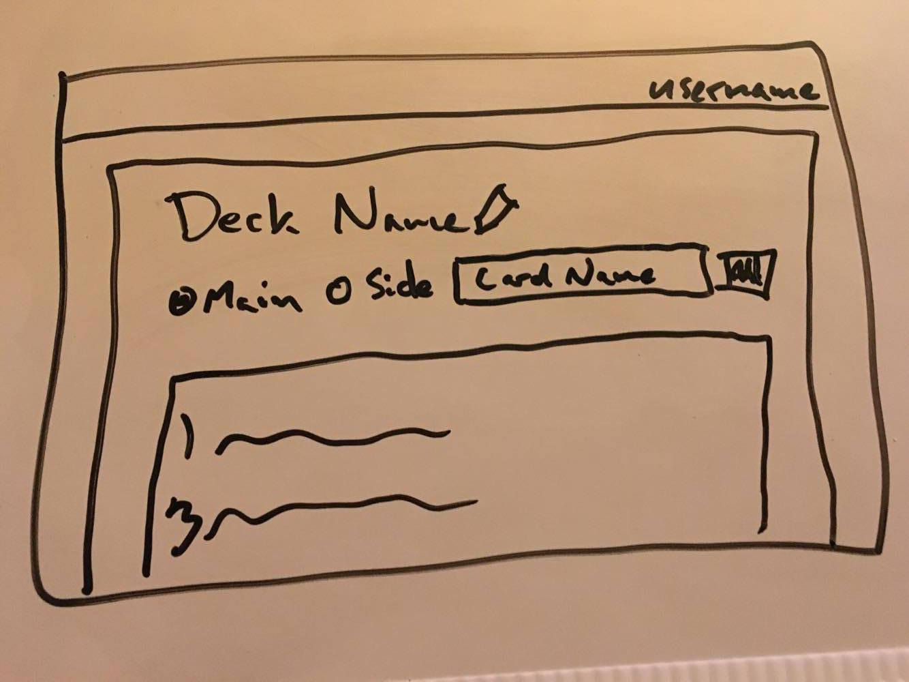

# README 
[Heroku Link](https://mtg-wdi43.herokuapp.com/)
## Description
This is a site dedicated to creating and sharing Magic: The Gathering Decks.  It will *hopefully* show meaningful information that current deck building sites do not make easily accessible 
## Technologies Used
* Ruby
* Rails
* Javascript
* CSS
* HTML
* Bootstrap
* Bootswatch
* Magicthegathering.io  
* bcrypt
* rename gem 

## Approach Taken
I started initially focusing on the card aspect of my project, but quickly realized I did not put enough focus on my databases and lead to me having to rebuild my models in a new project.  Once I was able to fully set up my MVC relations I was able to once again focus on how to fetch cards properly and what to do with their data.

##Installation Instructions
* Requires Rails 5 and Ruby 2.x
* Clone this repo
* Navigate to the files in terminal
* Run the following commands:
`bundle`  
`rails db:create`  
`rails db:migrate`  
`rails s`  
* Navigate to localhost:300 in your browser

##Unsolved Problems
* Allow user to be signed in after account creation
* Does not have most deck building features

## ERD 
###### (user and deck relationship should be swapped *oops*)

## Wireframes

## [Trello Link](https://trello.com/b/MRyyjxEc/project-2-mtg-deck-builder)

## Known Bugs
* Did not get users to be able to sign in automatically after signing up
* Card display algorithm gets slow once card count begins to get around 50+